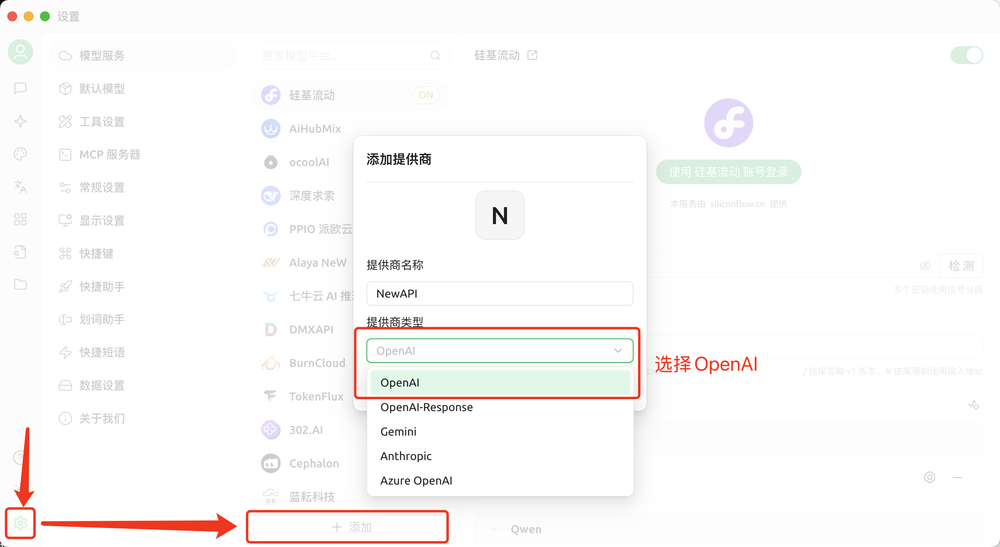
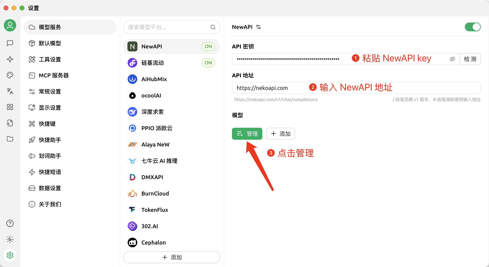
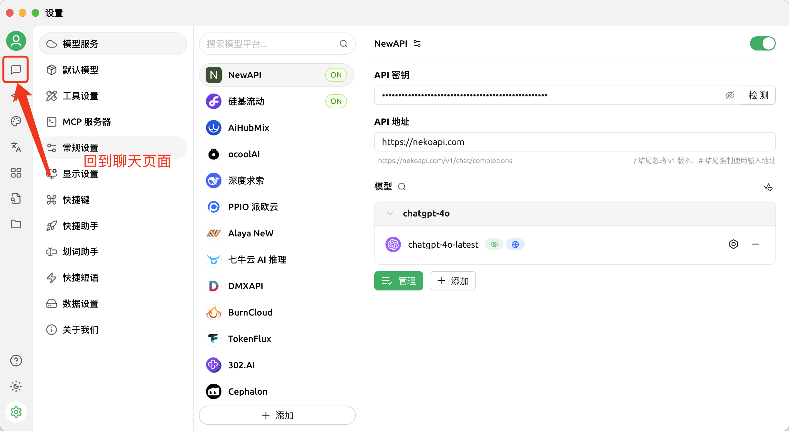
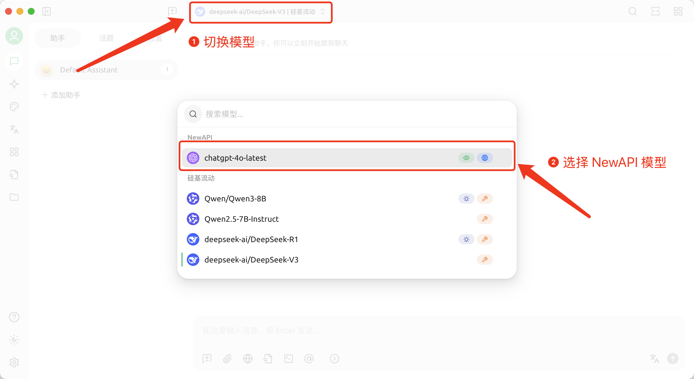

# Cherry Studio - 桌面 AI 客户端
!!! info
    🍒 Cherry Studio 是一款功能强大的桌面 AI 客户端，专为专业用户设计，集成了 30+ 行业智能助手，能够满足各种工作场景的需求，显著提升工作效率。

    - 官网地址：<https://cherry-ai.com/>
    - 下载地址：<https://cherry-ai.com/download>
    - 官方文档：<https://docs.cherry-ai.com>

## NewAPI 接入方法

### 参数填写

提供商类型：NewAPI 支持的类型  
API 密钥：于 NewAPI 获取  
API 地址：NewAPI 站点地址  

### 图文指引

1. 添加提供商

2. 在 NewAPI 中复制 API key

3. 填入 API 信息

4. 添加模型

5. 返回聊天页面

6. 切换 NewAPI 模型
