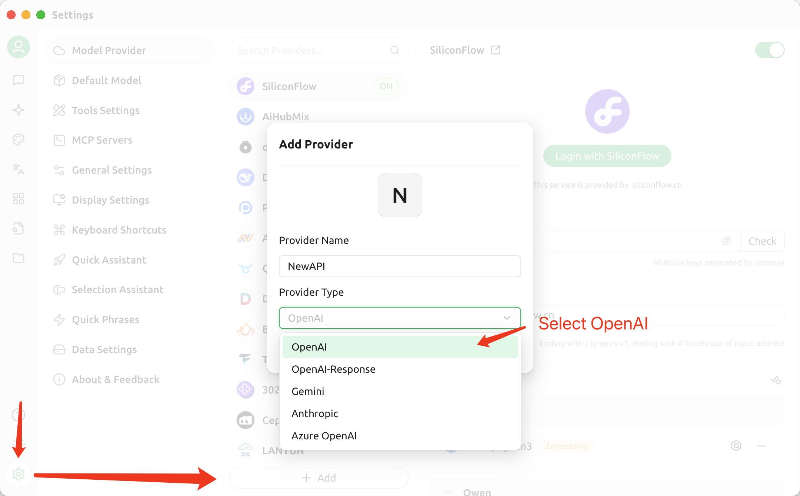
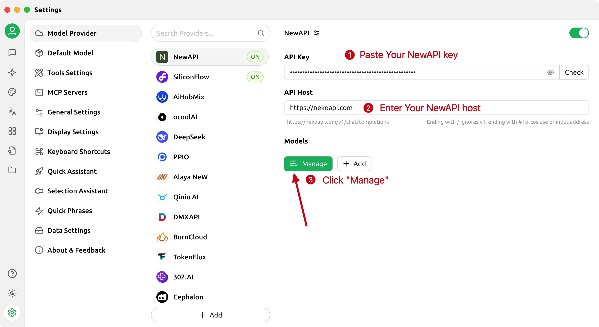
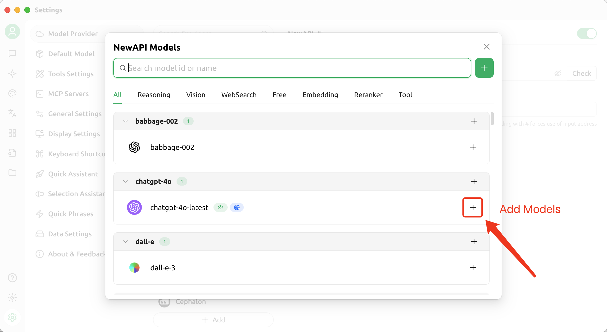
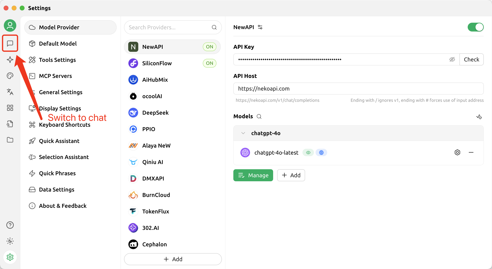
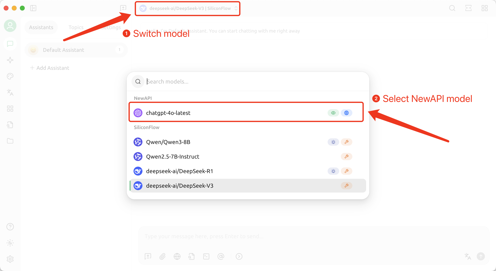
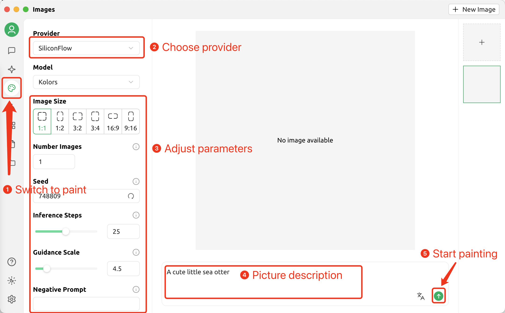

# Cherry Studio - Desktop AI Client
!!! info
    🍒 Cherry Studio is a powerful desktop AI client designed for professional users, integrating 30+ industry-specific AI assistants to meet various work scenario requirements and significantly improve work efficiency.

    - Official Website: <https://cherry-ai.com/>
    - Download: <https://cherry-ai.com/download>
    - Documentation: <https://docs.cherry-ai.com>

## NewAPI Integration Method

### Parameter Configuration

Provider Type: Any type supported by NewAPI  
API Key: Obtain from NewAPI  
API Host: NewAPI site address  

### Step-by-Step Guide

1. Add Provider

2. Copy API key from NewAPI

3. Fill in API Information

4. Add Models

5. Return to Chat Page

6. Switch to NewAPI Model

## Drawing in Cherry Studio

*First, you need to configure an API provider that supports drawing*

 