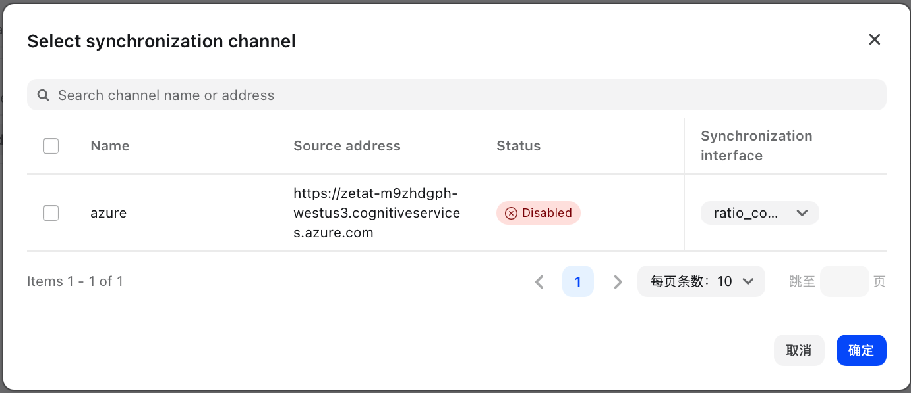

# Rate Settings

Rate settings are the core configuration of the NewAPI billing system, allowing flexible control over billing standards for different models and user groups through various rate multipliers.

## Rate System Overview

NewAPI uses a three-tier rate system to calculate actual user consumption:

1. Model Rate (ModelRatio) - Defines the base billing multiplier for different AI models
2. Completion Rate (CompletionRatio) - Additional billing adjustment for output tokens
3. Group Rate (GroupRatio) - Differential billing multipliers for different user groups

### Billing Calculation Formulas

#### Pay-per-use Models
```
Actual Cost = (Input Tokens + Output Tokens × Completion Rate) × Model Rate × Group Rate
```

#### Pay-per-request Models
```
Actual Cost = Model Fixed Price × Group Rate
```

#### Audio Models (Special Handling)
```
Actual Cost = (Text Input Tokens + Text Output Tokens × Completion Rate + Audio Input Tokens × Audio Rate + Audio Output Tokens × Audio Rate × Audio Completion Rate) × Model Rate × Group Rate
```

## Model Rate Settings

Model rates define the base billing multipliers for different AI models, with system-preset default rates for various models.

### Common Model Rate Examples

| Model Name | Official Price (Input) | Completion Rate |
|------------|------------------------|-----------------|
| gpt-4o | $2.5/1M Tokens | 1.25 |
| gpt-3.5-turbo | $0.5/1M Tokens | 0.25 |
| gpt-4o-mini | $0.15/1M Tokens | 0.075 |
| o1 | $15/1M Tokens | 7.5 |
| gpt-image-1 | $5/1M Tokens | 2.5 |

### Configuration Methods

1. JSON Format: Directly edit model rate JSON configuration
2. Visual Editor: Set rates through graphical interface


## Completion Rate Settings

Completion rates are used for additional billing adjustments on output tokens, mainly to balance the cost differences between input and output for different models.

### Default Completion Rates

| Model Type | Official Price (Input) | Official Price (Output) | Completion Rate | Description |
|------------|------------------------|-------------------------|-----------------|-------------|
| gpt-4o | $2.5/1M Tokens | $10/1M Tokens | 4 | Output is 4x the input price |
| gpt-3.5-turbo | $0.5/1M Tokens | $1/1M Tokens | 2 | Output is 2x the input price |
| gpt-image-1 | $5/1M Tokens | $40/1M Tokens | 8 | Output is 8x the input price |
| gpt-4o-mini | $0.15/1M Tokens | $0.6/1M Tokens | 4 | Output is 4x the input price |
| Other models | 1 | 1 | 1 | Equal billing for input and output |

### Configuration Notes

- Completion rates mainly affect output token billing
- Setting to 1 means equal billing for input and output tokens
- Greater than 1 means higher output token billing, less than 1 means lower output token billing

## Group Rate Settings

Group rates allow setting differential billing multipliers for different user groups, enabling flexible pricing strategies.

### Group Rate Configuration

```json
{
  "vip": 0.5,
  "premium": 0.8,
  "standard": 1.0,
  "trial": 2.0
}
```

### Group Rate Priority

1. User-specific Rate: Personal rate set for specific users
2. Group Rate: Rate for the user's group
3. Default Rate: System default rate (usually 1.0)


## Visual Rate Settings

The visual editor provides an intuitive rate management interface, supporting:

- Batch editing of model rates
- Real-time rate configuration preview
- Conflict detection and alerts
- One-click upstream rate synchronization


## Models Without Rate Settings

For models without rate settings, the system will:

1. Self-use Mode: Use default rate of 37.5
2. Business Mode: Show "Rate or price not configured" error
3. Auto Detection: Display unconfigured models in management interface


## Upstream Rate Synchronization

The system supports automatic rate synchronization from upstream channels:

- Automatically fetch upstream model rates
- Batch update local rate configurations
- Maintain synchronization with upstream pricing
- Support manual adjustment and override



## Frequently Asked Questions

### Q: How to set rates for new models?
A: You can add new models through the visual editor or directly add them to JSON configuration. It's recommended to start with conservative rates and adjust based on actual usage.

### Q: How do group rates take effect?
A: Group rates multiply with model rates, ultimately affecting user consumption calculation. User's actual rate = Model Rate × Group Rate.

### Q: What is the purpose of completion rates?
A: Completion rates are mainly used to balance the cost differences between input and output tokens. Some models have much higher output costs than input costs, requiring adjustment through completion rates.

### Q: How to batch set rates for similar models?
A: You can use the visual editor for batch operations, or directly add rate settings for similar models in JSON configuration.

For more billing rules, please refer to the [FAQ](../support/faq.md) 