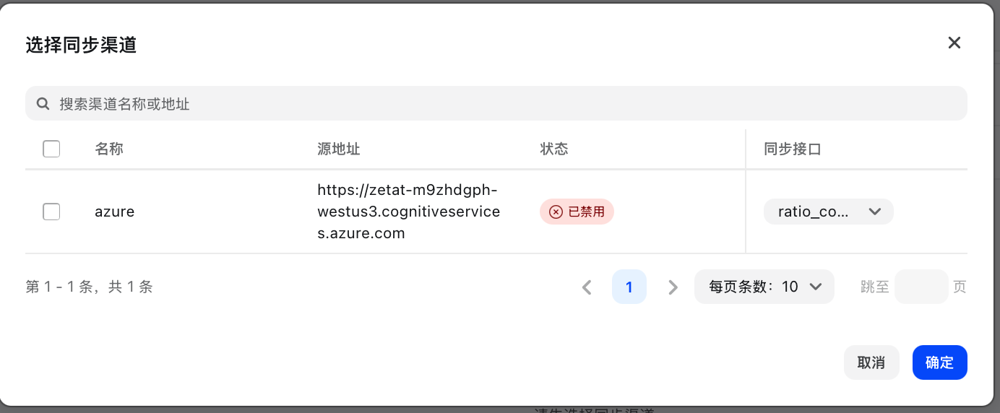

# 倍率设置

倍率设置是 NewAPI 计费系统的核心配置，通过设置不同的倍率可以灵活控制各种模型和用户组的计费标准。

## 倍率系统概述

NewAPI 使用三层倍率体系来计算用户的实际消费：

1. 模型倍率（ModelRatio） - 定义不同AI模型的基础计费倍数
2. 补全倍率（CompletionRatio） - 对输出token进行额外计费调整
3. 分组倍率（GroupRatio） - 为不同用户组设置差异化计费倍数

### 计费计算公式

#### 按量计费模型
```
实际消费 = (输入token数 + 输出token数 × 补全倍率) × 模型倍率 × 分组倍率
```

#### 按次计费模型
```
实际消费 = 模型固定价格 × 分组倍率
```

#### 音频模型（特殊处理）
```
实际消费 = (文本输入token + 文本输出token × 补全倍率 + 音频输入token × 音频倍率 + 音频输出token × 音频倍率 × 音频补全倍率) × 模型倍率 × 分组倍率
```

## 模型倍率设置

模型倍率定义了不同AI模型的基础计费倍数，系统为各种模型预设了默认倍率。

### 常见模型倍率示例

| 模型名称 | 官网价格（输入） | 补全倍率 |
|---------|---------|------|
| gpt-4o | 2.5$/1M Tokens | 1.25 |
| gpt-3.5-turbo | 0.5$/1M Tokens | 0.25 |
| gpt-4o-mini | 0.15$/1M Tokens | 0.075 |
| o1 | 15$/1M Tokens | 7.5 |
| gpt-image-1 | 5$/1M Tokens | 2.5 |

### 设置方法

1. JSON格式设置：直接编辑模型倍率JSON配置
2. 可视化编辑器：通过图形界面设置倍率


## 补全倍率设置

补全倍率用于对输出token进行额外计费，主要用于平衡不同模型的输入输出成本差异。

### 默认补全倍率

| 模型类型 | 官网价格（输入） | 官网价格（输出） | 补全倍率 | 说明 |
|---------|---------|------|------|------|
| gpt-4o | 2.5$/1M Tokens | 10$/1M Tokens | 4 | 输出是输入的4倍 |
| gpt-3.5-turbo | 0.5$/1M Tokens | 1$/1M Tokens | 2 | 输出是输入的2倍 |
| gpt-image-1 | 5$/1M Tokens | 40$/1M Tokens | 8 | 输出是输入的8倍 |
| gpt-4o-mini | 0.15$/1M Tokens | 0.6$/1M Tokens | 4 | 输出是输入的4倍 |
| 其他模型 | 1 | 1 | 1 | 输出是输入的1倍 |

### 设置说明

- 补全倍率主要影响输出token的计费
- 设置为1表示输出token计费与输入token计费相同
- 大于1表示输出token计费更高，小于1表示输出token计费更低

## 分组倍率设置

分组倍率允许为不同用户组设置差异化的计费倍数，实现灵活的定价策略。

### 分组倍率配置

```json
{
  "vip": 0.5,
  "premium": 0.8,
  "standard": 1.0,
  "trial": 2.0
}
```

### 分组倍率优先级

1. 用户专属倍率：为特定用户设置的个人倍率
2. 分组倍率：用户所属分组的倍率
3. 默认倍率：系统默认倍率（通常为1.0）


## 可视化倍率设置

可视化编辑器提供了直观的倍率管理界面，支持：

- 批量编辑模型倍率
- 实时预览倍率配置
- 冲突检测和提示
- 一键同步上游倍率


## 未设置倍率模型

对于未设置倍率的模型，系统会：

1. 自用模式：使用默认倍率37.5
2. 商业模式：提示"倍率或价格未配置"错误
3. 自动检测：在管理界面显示未配置的模型


## 上游倍率同步

系统支持从上游渠道自动同步倍率设置：

- 自动获取上游模型倍率
- 批量更新本地倍率配置
- 保持与上游价格同步
- 支持手动调整和覆盖



## 常见问题

### Q: 如何为新模型设置倍率？
A: 可以通过可视化编辑器添加新模型，或直接在JSON配置中添加。建议先设置保守倍率，根据实际使用情况调整。

### Q: 分组倍率如何生效？
A: 分组倍率会与模型倍率相乘，最终影响用户的消费计算。用户的实际倍率 = 模型倍率 × 分组倍率。

### Q: 补全倍率的作用是什么？
A: 补全倍率主要用于平衡输入输出token的成本差异。某些模型的输出成本远高于输入成本，需要通过补全倍率进行调整。

### Q: 如何批量设置相似模型的倍率？
A: 可以通过可视化编辑器进行批量操作，或者直接在JSON配置中批量添加相似模型的倍率设置。

有关更多计费规则，请查看[常见问题](../support/faq.md)