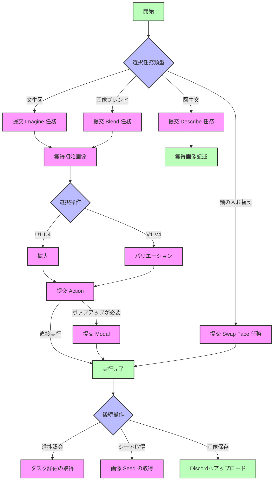

## コアコンセプト (Core Concepts)

| 日本語 | English | 説明 | Description |
|------|---------|------|-------------|
| レート | Ratio | 価格計算に使用される乗数ファクター | Multiplier factor used for price calculation |
| トークン | Token | APIアクセス認証情報、またはモデルが処理するテキスト単位 | API access credentials or text units processed by models |
| チャネル | Channel | APIサービスプロバイダーのアクセスチャネル | Access channel for API service providers |
| グループ | Group | ユーザーまたはトークンの分類。価格レートに影響を与える | Classification of users or tokens, affecting price ratios |
| クォータ | Quota | ユーザーが利用可能なサービス枠 | Available service quota for users |

# Midjourney 画像フォーマット（Midjourney Proxy/Midjourney Proxy Plus）

!!! note "ご注意ください"
    このインターフェースは **Midjourney公式のインターフェースではありません**。著者 **novicezk** のオープンソースプロジェクト [**midjourney-proxy**](https://github.com/novicezk/midjourney-proxy) に基づいて実装されたMidjourneyプロキシインターフェースです。
    
    このプロジェクトには2つのバージョンがあり、New APIは両方に対応しています：
    
    - オープンソース版 [midjourney-proxy](https://github.com/novicezk/midjourney-proxy)
    
    - 有料版 [midjourney-proxy-plus](https://github.com/litter-coder/midjourney-proxy-plus)

    Midjourneyの強力な機能を便利に利用できるようにしてくださった作者の貢献に深く感謝いたします。もしお時間があれば、作者にStarを付けてください。能力があれば、より多くの機能をサポートしている作者の有料版を支援することをお勧めします。

| 機能カテゴリ | オープンソース版 | 有料版 |
|---------|--------|--------|
| **基本機能** | | |
| Imagineコマンドおよび関連アクション | ✓ | ✓ |
| 参照画像（Img2Img）サポート | ✓ | ✓ |
| Blend（画像ブレンド） | ✓ | ✓ |
| Describe（画像からテキスト生成） | ✓ | ✓ |
| タスクのリアルタイム進捗 | ✓ | ✓ |
| 中国語プロンプト翻訳 | ✓ | ✓ |
| プロンプトのセンシティブワード検出 | ✓ | ✓ |
| user-tokenによるWSS接続 | ✓ | ✓ |
| マルチアカウント設定 | ✓ | ✓ |
| **高度な機能** | | |
| Shorten（プロンプト分析） | ✗ | ✓ |
| 焦点移動 (Pan) | ✗ | ✓ |
| 画像ズーム (Zoom) | ✗ | ✓ |
| 部分的な再描画 (Vary Region) | ✗ | ✓ |
| 関連ボタンアクションとRemixモード | ✗ | ✓ |
| 画像シード値の取得 | ✗ | ✓ |
| **アカウント管理** | | |
| アカウントプールの永続化 | ✗ | ✓ |
| 多様なストレージサポート (Redis/MySQL) | ✗ | ✓ |
| アカウント情報の取得と設定 | ✗ | ✓ |
| タスクキャンセル機能 | ✗ | ✓ |
| 組み込み管理バックエンド | ✗ | ✓ |
| **スマート機能** | | |
| MJ V6.0サポート | ✗ | ✓ |
| アカウント状態の自動監視 | ✗ | ✓ |
| モードの自動切り替え | ✗ | ✓ |
| niji・journey Botサポート | ✗ | ✓ |
| InsightFace顔認識サービス | ✗ | ✓ |
| **セキュリティ性能** | | |
| 動的設定サポート | ✗ | ✓ |
| トークン切断問題の修正 | ✗ | ✓ |
| 自動検証機能 | ✗ | ✓ |
| 禁止ワードの自動異議申し立て | ✗ | ✓ |

## 📝 概要

Midjourneyは、自然言語の記述に基づいて画像を生成、編集、修正できる強力な画像生成および処理モデルです。さまざまなインターフェースを提供することで、多様な画像生成および処理タスクを実現できます。

## 🔄 フローチャート



### フローの説明

1. **初期タスク**
   - Imagine: テキストから画像を生成
   - Blend: 複数画像をブレンド
   - Describe: 画像の説明を生成
   - Swap Face: 顔の入れ替え

2. **画像処理**
   - U1-U4: 拡大操作
   - V1-V4: バリエーション生成
   - Pan: 画像のパン（平行移動）
   - Zoom: 画像のズーム

3. **特殊なフロー**
   - Action + Modal: ポップアップ確認が必要な操作
   - Action 直接実行: ポップアップが不要な操作

4. **タスク管理**
   - タスク詳細の取得
   - 画像シードの取得
   - Discordへのアップロード

## 💡 リクエスト例

### Imagineタスクの送信 ✅

```bash
curl --location --request POST 'https://你的newapi服务器地址/mj/submit/imagine' \
--header 'Authorization: Bearer $NEWAPI_API_KEY' \
--header 'Accept: application/json' \
--header 'Content-Type: application/json' \
--data-raw '{
  "botType": "MID_JOURNEY",
  "prompt": "Cat",
  "base64Array": [],
  "accountFilter": {
    "channelId": "",
    "instanceId": "",
    "modes": [],
    "remark": "",
    "remix": true,
    "remixAutoConsidered": true
  },
  "notifyHook": "",
  "state": ""
}'
```

**応答例:**

```json
{
  "code": 1,
  "description": "提交成功",
  "properties": {},
  "result": 1320098173412546
}
```

### Blendタスクの送信 ✅

```bash
curl --location --request POST 'https://你的newapi服务器地址/mj/submit/blend' \
--header 'Authorization: Bearer $NEWAPI_API_KEY' \
--header 'Accept: application/json' \
--header 'Content-Type: application/json' \
--data-raw '{
  "botType": "MID_JOURNEY",
  "base64Array": [
    "data:image/png;base64,xxx1",
    "data:image/png;base64,xxx2"
  ],
  "dimensions": "SQUARE",
  "accountFilter": {
    "channelId": "",
    "instanceId": "",
    "modes": [],
    "remark": "",
    "remix": true,
    "remixAutoConsidered": true
  },
  "notifyHook": "",
  "state": ""
}'
```

**応答例:**

```json
{
  "code": 1,
  "description": "提交成功",
  "properties": {},
  "result": 1320098173412546
}
```

### Describeタスクの送信 ✅

```bash
curl --location --request POST 'https://你的newapi服务器地址/mj/submit/describe' \
--header 'Authorization: Bearer $NEWAPI_API_KEY' \
--header 'Accept: application/json' \
--header 'Content-Type: application/json' \
--data-raw '{
  "botType": "MID_JOURNEY",
  "base64": "data:image/png;base64,xxx",
  "accountFilter": {
    "channelId": "",
    "instanceId": "",
    "modes": [],
    "remark": "",
    "remix": true,
    "remixAutoConsidered": true
  },
  "notifyHook": "",
  "state": ""
}'
```

**応答例:**

```json
{
  "code": 1,
  "description": "提交成功",
  "properties": {},
  "result": 1320098173412546
}
```

### Modalの送信 ✅

```bash
curl --location --request POST 'https://你的newapi服务器地址/mj/submit/modal' \
--header 'Authorization: Bearer $NEWAPI_API_KEY' \
--header 'Accept: application/json' \
--header 'Content-Type: application/json' \
--data-raw '{
  "maskBase64": "",
  "prompt": "",
  "taskId": "14001934816969359"
}'
```

**応答例:**

```json
{
  "code": 1,
  "description": "提交成功",
  "properties": {},
  "result": 1320098173412546
}
```

### swap_faceタスクの送信 ✅

```bash
curl --location --request POST 'https://你的newapi服务器地址/mj/insight-face/swap' \
--header 'Authorization: Bearer $NEWAPI_API_KEY' \
--header 'Accept: application/json' \
--header 'Content-Type: application/json' \
--data-raw '{
  "sourceBase64": "data:image/jpeg;base64,/9j/4AAQSkZJRgABAQAAAQABAAD/2wCEAAkGBwgHBgkIBwgKCgkLDRYPDQwMDRsUFRAWIB0iIiAdHx8kKDQsJCYxJx8fLT0tMTU3Ojo6Iys/RDnYdriP1wsS81kwU8OVs/R3xu8s6bX7+zYnOH8coSqpmRSBjqerjcBlr2OB/lbAf/2Q==",
  "targetBase64": "data:image/jpeg;base64,/9j/4AAQSkZJRgABAQAAAQABAAD/2wCEAAkGBwgHBgkIBwgKCgkLDRYPDQwMDRsUFRAWIB0iIiAdHx8kKDQsJCYxJx8fLT0tMTU3Ojo6Iys/RD849k="
}'
```

**応答例:**

```json
{
  "code": 0,
  "description": "string",
  "result": "string"
}
```

### Action動作の実行 ✅

```bash
curl --location --request POST 'https://你的newapi服务器地址/mj/submit/action' \
--header 'Authorization: Bearer $NEWAPI_API_KEY' \
--header 'Accept: application/json' \
--header 'Content-Type: application/json' \
--data-raw '{
  "chooseSameChannel": true,
  "customId": "MJ::JOB::upsample::1::82c51c9d-bc33-4c07-a471-36c3dcb1a6f0",
  "taskId": "1728781324658687",
  "accountFilter": {
    "channelId": "",
    "instanceId": "",
    "modes": [],
    "remark": "",
    "remix": true,
    "remixAutoConsidered": true
  },
  "notifyHook": "",
  "state": ""
}'
```

**応答例:**

```json
{
  "code": 1,
  "description": "提交成功",
  "properties": {},
  "result": 1320098173412546
}
```

### Discordへのファイルのアップロード ✅

```bash
curl --location --request POST 'https://你的newapi服务器地址/mj/submit/upload-discord-images' \
--header 'Authorization: Bearer $NEWAPI_API_KEY' \
--header 'Accept: application/json' \
--header 'Content-Type: application/json' \
--data-raw '{
  "base64Array": [],
  "filter": {
    "channelId": "",
    "instanceId": "",
    "remark": ""
  }
}'
```

**応答例:**

```json
{
  "code": 0,
  "description": "string",
  "result": [
    "string"
  ]
}
```

### IDリストによるタスクの照会 ✅

```bash
curl --location --request POST 'https://你的newapi服务器地址/mj/task/list-by-condition' \
--header 'Accept: application/json' \
--header 'Authorization: Bearer $NEWAPI_API_KEY' \
--header 'Content-Type: application/json' \
--data-raw '{
  "ids": []
}'
```

**応答例:**

```json
[
  {
    "action": "IMAGINE",
    "buttons": [
      {
        "customId": "string",
        "emoji": "string",
        "label": "string",
        "style": 0,
        "type": 0
      }
    ],
    "description": "string",
    "failReason": "string",
    "finishTime": 0,
    "id": "string",
    "imageUrl": "string",
    "progress": "string",
    "prompt": "string",
    "promptEn": "string",
    "properties": {},
    "startTime": 0,
    "state": "string",
    "status": "NOT_START",
    "submitTime": 0
  }
]
```

### 指定IDによるタスクの取得 ✅

```bash
curl --location --request GET 'https://你的newapi服务器地址/mj/task/{id}/fetch' \
--header 'Accept: application/json' \
--header 'Authorization: Bearer $NEWAPI_API_KEY' \
--header 'Content-Type: application/json'
```

**応答例:**

```json
{
  "action": "IMAGINE",
  "buttons": [
    {
      "customId": "string",
      "emoji": "string",
      "label": "string",
      "style": 0,
      "type": 0
    }
  ],
  "description": "string", 
  "failReason": "string",
  "finishTime": 0,
  "id": "string",
  "imageUrl": "string",
  "progress": "string",
  "prompt": "string",
  "promptEn": "string",
  "properties": {},
  "startTime": 0,
  "state": "string",
  "status": "NOT_START",
  "submitTime": 0
}
```

### タスク画像のシードの取得 ✅

```bash
curl --location --request GET 'https://你的newapi服务器地址/mj/task/{id}/image-seed' \
--header 'Accept: application/json' \
--header 'Authorization: Bearer $NEWAPI_API_KEY' \
--header 'Content-Type: application/json'
```

**応答例:**

```json
{
  "code": 0,
  "description": "string",
  "result": "string"
}
```

## 📮 リクエスト

### エンドポイント

#### Imagineタスクの送信
```
POST /mj/submit/imagine
```

テキストプロンプトに基づいて画像を生成します。

#### Blendタスクの送信
```
POST /mj/submit/blend
```

複数の入力画像をブレンドして新しい画像を生成します。

#### Describeタスクの送信
```
POST /mj/submit/describe
```

入力画像に基づいてテキストによる説明を生成します。

#### Modalの送信
```
POST /mj/submit/modal
```

モーダル情報を送信し、画像生成の詳細を調整するために使用します。

#### swap_faceタスクの送信
```
POST /mj/insight-face/swap
```

ソース画像とターゲット画像に基づいて顔を交換します。

#### Action動作の実行
```
POST /mj/submit/action
```

すでに生成された画像に対して、拡大や調整などの後続操作を実行します。

#### Discordへのファイルのアップロード
```  
POST /mj/submit/upload-discord-images
```

画像をDiscordプラットフォームにアップロードします。

#### IDリストによるタスクの照会
```
POST /mj/task/list-by-condition
```

指定されたタスクIDリストに基づいてタスクの詳細を照会します。

#### 指定IDによるタスクの取得
```  
GET /mj/task/{id}/fetch
```

タスクIDに基づいてタスクの詳細を取得します。

#### タスク画像のシードの取得
```
GET /mj/task/{id}/image-seed
```

指定されたタスクによって生成された画像のシード値を取得します。

### 認証方法

APIキー認証のために、リクエストヘッダーに以下の内容を含めます：

```
Authorization: Bearer $NEWAPI_API_KEY$OPENAI_API_KEY
```

ここで `$OPENAI_API_KEY` はあなたのAPIキーです。

### リクエストボディパラメータ

#### Imagineタスクの送信

##### `botType`
- タイプ：列挙型文字列
- 必須：いいえ
- デフォルト値：MID_JOURNEY
- 選択可能な値：
  - `MID_JOURNEY`: Midjourney モデル
  - `NIJI_JOURNEY`: Niji Journey モデル
- 説明：使用するBotのタイプを選択します

##### `prompt`
- タイプ：文字列
- 必須：はい
- 説明：画像を生成するためのテキストプロンプト
- ヒント：
  - 明確で具体的な記述を使用してください
  - アートスタイル、構図などの詳細を含めることができます
  - 英語および中国語の入力に対応しています

##### `base64Array`
- タイプ：文字列配列
- 必須：いいえ
- 説明：参照画像（Img2Img）のBase64エンコード配列
- 形式：各要素は、MIMEタイププレフィックスを含む完全なBase64画像文字列である必要があります

##### `accountFilter`
- タイプ：オブジェクト
- 必須：いいえ
- 属性：
  - `channelId`: チャンネルID
  - `instanceId`: アカウントインスタンスID
  - `modes`: アカウントモードの配列。選択可能な値：RELAX、FAST、TURBO
  - `remark`: 備考に含まれる内容
  - `remix`: アカウントがRemixをサポートしているかどうか
  - `remixAutoConsidered`: Remixの自動送信設定

##### `notifyHook`
- タイプ：文字列
- 必須：いいえ
- 説明：タスク完了後のコールバックアドレス。空の場合はグローバルなnotifyHookが使用されます

##### `state`
- タイプ：文字列
- 必須：いいえ
- 説明：リクエストの追跡に使用できるカスタムステータスパラメータ

#### Blendタスクの送信

##### `base64Array`
- タイプ：文字列配列
- 必須：はい
- 説明：ブレンドする画像のBase64エンコード配列
- 形式：2〜5枚の画像のBase64文字列を含める必要があります

##### `dimensions`
- タイプ：列挙型文字列
- 必須：いいえ
- 選択可能な値：
  - `PORTRAIT`: 2:3の比率
  - `SQUARE`: 1:1の比率
  - `LANDSCAPE`: 3:2の比率
- 説明：出力画像の縦横比設定

#### Describeタスクの送信

##### `base64`
- タイプ：文字列
- 必須：はい
- 説明：説明が必要な画像のBase64エンコード
- 形式：MIMEタイププレフィックスを含む完全なBase64文字列

#### Modalタスクの送信

##### `maskBase64`
- タイプ：文字列
- 必須：いいえ
- 説明：部分的な再描画のためのマスク画像のBase64エンコード

##### `prompt`
- タイプ：文字列
- 必須：いいえ
- 説明：再描画エリアのテキストプロンプト

##### `taskId`
- タイプ：文字列
- 必須：はい
- 説明：元のタスクのID

#### Swap Faceタスクの送信

##### `sourceBase64`
- タイプ：文字列
- 必須：はい
- 説明：顔のソース画像のBase64エンコード
- 要件：画像には明確な顔が含まれている必要があります

##### `targetBase64`
- タイプ：文字列
- 必須：はい
- 説明：ターゲット画像のBase64エンコード
- 要件：画像には置き換えたい顔が含まれている必要があります

#### Action動作の実行

##### `chooseSameChannel`
- タイプ：ブール値
- 必須：いいえ
- デフォルト値：false
- 説明：同じチャンネル下のアカウントを選択するかどうか

##### `customId`
- タイプ：文字列
- 必須：はい
- 説明：アクション識別子
- 形式：特定の形式の文字列。例："MJ::JOB::upsample::1::xxx"

##### `taskId`
- タイプ：文字列
- 必須：はい
- 説明：アクションを実行するタスクのID

#### Discordへのファイルのアップロード

##### `base64Array`
- タイプ：文字列配列
- 必須：はい
- 説明：アップロードする画像のBase64エンコード配列

##### `filter`
- タイプ：オブジェクト
- 必須：いいえ
- 属性：
  - `channelId`: ターゲットチャンネルID
  - `instanceId`: アカウントインスタンスID
  - `remark`: 備考情報

#### IDリストによるタスクの照会

##### `ids`
- タイプ：文字列配列
- 必須：はい
- 説明：照会するタスクIDのリスト

### 共通応答形式

すべてのインターフェースは類似した応答構造を返します：

##### `code`
- タイプ：整数
- 説明：ステータスコード

| ステータスコード | 説明 |
|--------|------|
| 1 | 送信成功 |
| 22 | タスクがキューイング中 |
| 21 | パラメータエラー |
| 23 | システムエラー |
| 24 | アカウントが利用不可 |
| 25 | 残高不足 |

##### `description`
- タイプ：文字列
- 説明：応答記述情報

##### `properties`
- タイプ：オブジェクト
- 説明：拡張属性

##### `result`
- タイプ：文字列または配列
- 説明：返される結果。タスクIDまたはその他のデータである可能性があります

## 📥 応答

### 成功応答

#### `action`
- タイプ：列挙型文字列
- 説明：タスクタイプ

| 文字列値 | 説明 |
|--------|------|
| `IMAGINE` | 画像の作成 |
| `UPSCALE` | 画像の拡大 |
| `VARIATION` | バリエーション生成 |
| `ZOOM` | 画像のズーム |
| `PAN` | 画像のパン |
| `DESCRIBE` | 画像の説明 |
| `BLEND` | 画像のブレンド |
| `SHORTEN` | プロンプトの短縮 |
| `SWAP_FACE` | 顔の入れ替え |

#### `buttons`
- タイプ：オブジェクト配列
- 説明：実行可能な操作ボタン

| 配列に含まれる属性 | 説明 |
|--------|------|
| `customId` | アクション識別子 |
| `emoji` | ボタンアイコン |
| `label` | ボタンテキスト |
| `style` | スタイル(2=Primary, 3=Green) |
| `type` | システム内部で使用されるタイプ |

#### `description`
- タイプ：文字列
- 説明：タスク記述情報

#### `failReason`
- タイプ：文字列
- 説明：タスク失敗の理由

#### `finishTime`
- タイプ：整数
- 説明：タスク完了タイムスタンプ

#### `id`
- タイプ：文字列
- 説明：タスクの一意の識別子

#### `imageUrl`
- タイプ：文字列
- 説明：生成された画像のURL

#### `progress`
- タイプ：文字列
- 説明：タスクの進捗情報

#### `prompt`
- タイプ：文字列
- 説明：元のプロンプト

#### `promptEn`
- タイプ：文字列
- 説明：英語のプロンプト

#### `status`
- タイプ：列挙型文字列
- 説明：タスクステータス

| 文字列値 | 説明 |
|--------|------|
| `NOT_START` | 未開始 |
| `SUBMITTED` | 送信済み |
| `MODAL` | モーダル操作中 |
| `IN_PROGRESS` | 進行中 |
| `FAILURE` | 失敗 |
| `SUCCESS` | 成功 |
| `CANCEL` | キャンセル済み |

#### `submitTime`
- タイプ：整数
- 説明：タスク送信タイムスタンプ

#### `startTime`
- タイプ：整数
- 説明：タスク実行開始タイムスタンプ

### エラー応答

リクエストに問題が発生した場合、APIはエラー応答を返します：

#### HTTPステータスコード
- `400 Bad Request`: リクエストパラメータが無効
- `401 Unauthorized`: APIキーが無効または提供されていません
- `403 Forbidden`: 権限不足
- `404 Not Found`: リソースが存在しません
- `429 Too Many Requests`: リクエスト頻度が上限を超過
- `500 Internal Server Error`: サーバー内部エラー

#### エラー応答形式
```json
{
  "code": <エラーコード>,
  "description": "エラー記述情報",
  "result": null
}
```

## 💡 ベストプラクティス

### プロンプト作成のヒント

1. 期待する画像の内容を明確かつ簡潔な言葉で記述します
2. Midjourneyがサポートする様々なパラメータを参照して、画像スタイルを制御できます
3. 不要な要素を除外するために、否定的な記述を適切に使用します
4. 画像URLを参照として使用し、生成をガイドできます

### 画像生成フロー

1. Imagineタスクを送信し、最初の画像を取得します
2. 必要に応じて、Blend、Modalなどのタスクを通じてさらに最適化します
3. Action動作を実行して画像を微調整します
4. 満足のいく結果画像をアップロードして保存します

### 画像フォーマットの要件

1. サポートされている画像フォーマット：
   
   - JPEG/JPG
   
   - PNG
   
   - GIF (静止画)
   
   - WEBP

2. 画像サイズの制限：
   
   - ファイルサイズ：最大 4MB
   
   - 解像度：1024x1024以上を推奨
   
   - 縦横比：1:1、2:3、3:2をサポート

### パフォーマンス最適化のヒント

1. Base64エンコード：
   
   - 標準のBase64エンコード形式を使用します
   
   - 正しいMIMEタイププレフィックスを含めます
   
   - データ転送を減らすために画像を圧縮します

2. タスク処理：
   
   - Webhookを使用してタスク完了通知を受け取ります
   
   - 適切な再試行ポリシーを設定します
   
   - 非同期処理方式の使用を推奨します

### エラー処理

   - リクエスト再試行メカニズムを実装します
   
   - エラーログ記録を追加します
   
   - 適切なタイムアウト時間を設定します